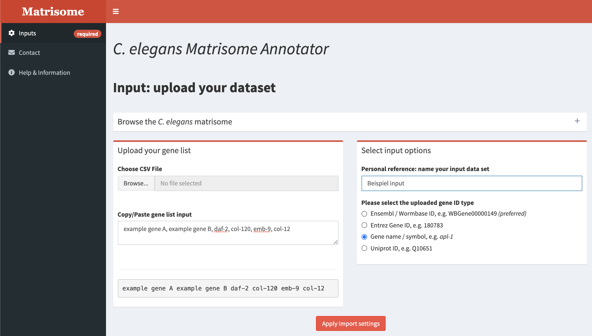
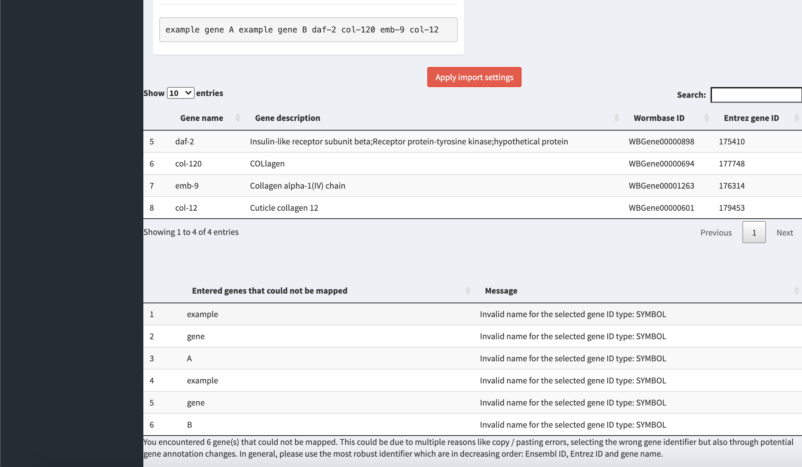
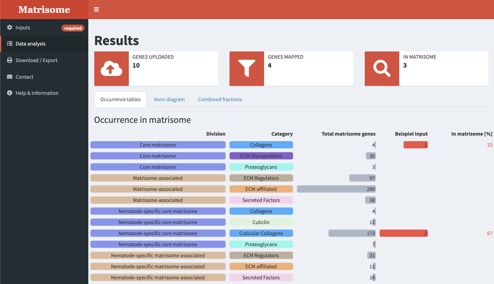
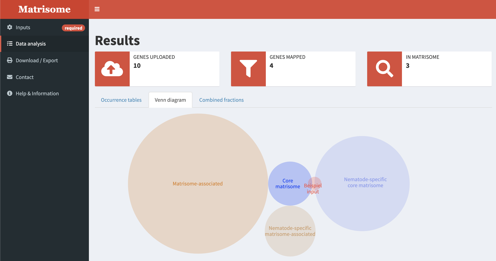
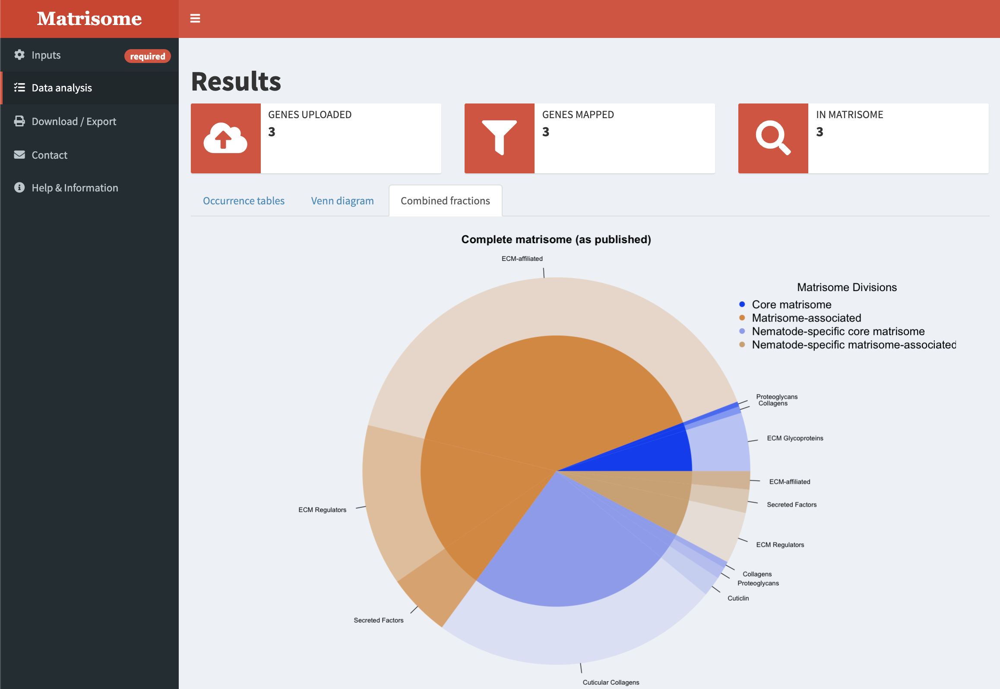
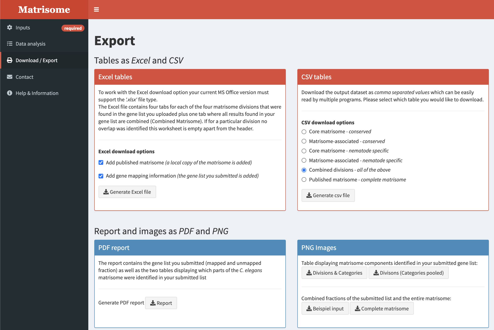

# Matrisome annotator tool

To facilitate researchers to capitalize on our definition of the C. elegans matrisome I developed a web resource: 

## Available resources
- [Tool](http://ce-matrisome-annotator.permalink.cc) to interactively analyze datasets.
- [Publication](https://doi.org/10.1016/j.mbplus.2018.11.001) containing all information.
- [Docs & Tutorial](https://ars.els-cdn.com/content/image/1-s2.0-S2590028518300012-mmc9.pdf) Supplementary information of the publication.

## Setup
1. Clone repository.
2. Install needed packages (under development).
3. Run App (using [RStudio](https://rstudio.com)).

## App preview

### Importing genes of interest

### Gene name conversion

### Matrisome division and category of supplied genes

### Set overlap

### Relative abundances of matrisome divisions and categories

### Export options

